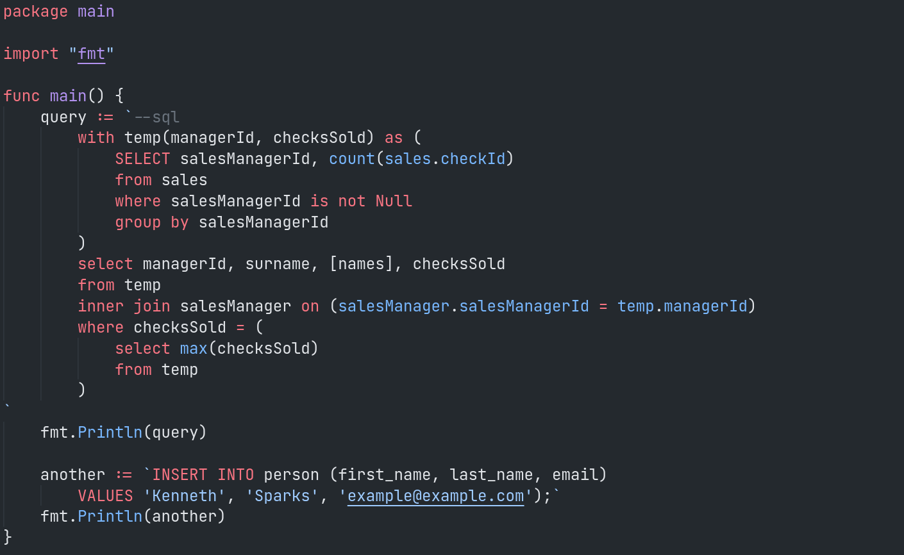
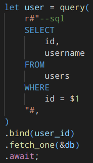

# Inline SQL 

>Also available in [Open VSX Registry](https://open-vsx.org/extension/qufiwefefwoyn/inline-sql-syntax)


Highlight and lint inline SQL strings.
Supported languages are **Python**, **Go**, **JavaScript**, **TypeScript**, **Ruby**, **Java**, **C#**, **Rust**, **PHP**.

Syntax highlighting works for strings starting with `--sql` or any of
the `SELECT`, `INSERT`, `INTO`, `DELETE`, `UPDATE`, `CREATE TABLE`.

**Linting and diagnostics powered entirely by awesome
[joereynolds/sql-lint](https://github.com/joereynolds/sql-lint) and works for
multiline strings that start with either <code>\`--sql</code> (backtick followed by `--sql`),
`"--sql` or `"""--sql`.**

## Safety

The proper way to sanitize data for insertion into your database is to
use placeholders for all variables to be inserted into your SQL strings.
In other words, NEVER do this (Python example):

```python
query = f"INSERT INTO foo (bar, baz) VALUES ( {variable1}, {variable2} )";
```

Instead, use `$` placeholders (or `?` in some databases):

```python
query = "INSERT INTO foo (bar, baz) VALUES ( $1, $2  )";
```

And then pass the variables to be replaced when you execute the query.
For example with [pgx](https://github.com/JackC/pgx) (Go example):

```go
err = conn.QueryRow(
    context.Background(),
    "select name, weight from widgets where id=$1",
    42,
).Scan(&name, &weight)
```

## Integration with real database

Integration with real database is available and controlled through VSCode options:

```json
{
    "inlineSQL.enableDBIntegration": true,
    "inlineSQL.dbDriver": "postgres",
    "inlineSQL.dbHost": "localhost",
    "inlineSQL.dbPort": 5432,
    "inlineSQL.dbUser": "postgres",
    "inlineSQL.dbPassword": "postgres"
}
```

## Examples

### Python


### JavaScript/TypeScript


### Go


## More syntax highlighting examples

<table style="width:100%; border: none!important;">
  <tr>
    <td>Python</td>
    <td>JavaScript/TypeScript</td>
  </tr>
  <tr>
    <td></td>
    <td></td>
  </tr>
</table>

<table style="width:100%; border: none!important;">
  <tr>
    <td>Ruby</td>
    <td>Java</td>
  </tr>
  <tr>
    <td></td>
    <td></td>
  </tr>
</table>

<h3 style="text-align:center;">Go</h3>



Currently gopls semantic token highlighting (option `gopls.ui.semanticTokens` -  off by default)
overrides extension's syntax. If anyone knows how to fix this, please share.

<h3 style="text-align:center;">Rust</h3>



If used alongside `rust-analyzer`, the setting `"rust-analyzer.highlighting.strings": false` has to be set,
otherwise the string semantic token will override the syntax highlight of this extension.

## Motivation

This small extension is meant to help those who don't use ORM and don't like SQL builders
like [squirrel](https://github.com/Masterminds/squirrel),
but still want inline sql in their code to be something more than magic strings,
helping to avoid small bugs and typos almost instantly.

## Related

- [joereynolds/sql-lint](https://github.com/joereynolds/sql-lint) - Used for linting.
- [joe-re/sql-language-server](https://github.com/joe-re/sql-language-server) - SQL Language Server, consider it if you use separate files for sql.
- [cmoog/vscode-sql-notebook](https://github.com/cmoog/vscode-sql-notebook) - Open SQL files as VSCode Notebooks.
